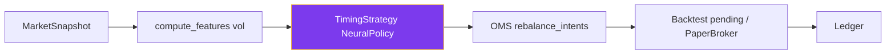

<div align="center">

<!-- 邪王真眼 Header -->


<!-- Typing 语录 -->
<a href="https://git.io/typing-svg"></a>

<!-- Rikka Banner Row -->
<p>
  
  
</p>
<!-- Badges 魔法阵 -->

<p>
  
  
  
  
  
</p>

<p>
  
  
  
  
</p>

> **「漆黑烈焰使，参上！」** — 小鸟游六花 `Takanashi Rikka` ｜ 深蓝发 · 金瞳(右) · 眼带 · 150cm · 6/12 双子座
> *Behold, the Wicked Lord Shingan!* — 研究 / paper 共用同一条 DeskCycle。CLI **不会**往交易所发签名订单。

</div>

---

<div align="center">

### ✦ 契约概览 · 六花酱为你解说 ✦

</div>

<table align="center">
<tr>
<td align="center" width="33%">
**🎀 单币纯爱**
<br/>
`ETHUSDT` Only
<br/>
<sub>没有多币后宫</sub><br/>
<sub>只爱以太酱一人</sub>

</td>
<td align="center" width="33%">

**👁️ PPO 择时**
<br/>
决策网输出 unit ∈ [-1,1]
<br/>
<sub>缺权重 = 空仓，没有 TSMOM 回退</sub><br/>
<sub>看破不可视境界线</sub>

</td>
<td align="center" width="33%">

**💜 连续仓位**
<br/>
PPO Actor → unit
<br/>
<sub>不是 -1/0/1 三档</sub><br/>
<sub>|unit|&lt;5% 直接空仓</sub>

</td>
</tr>
</table>

<div align="center">

| <sub>魔法术式</sub> | <sub>咏唱内容</sub> |
|:--:|:---|
| **杠杆** | `lev = min(maxLev, targetVol/σ)` 波动高自动降杠杆 ✨ |
| **名义本金** | `notional = equity × risk_budget × lev × unit` |
| **空仓过滤** | `|unit|<0.05 → 0` 灰尘仓由六花酱净化掉 |
| **多空** | `long_only:false` 默认多空都做 · `true` 时跌势空仓不做空 |
| **成交** | `T收盘算信号 → T+1开盘成交` 回测与 paper 同一时钟 |
| **权重** | checkpoint 缺失或对不上 → 空仓，不回退规则 |

<sub>回测 ≠ 实盘 · 不是投资建议 · 研究事实：这是过程，不是承诺的夏普</sub>

</div>

---

<div align="center">

### 🌙 魔法回路 — 现在真正在跑的链路

</div>



<details>
<summary>🔮 点击展开 · 每一段实际在做什么</summary>

1. **行情** — 公开 REST 拉 1h K 线（paper 也打主网行情）。拉不到 K 线就报错，不会偷偷换成 demo。缺资金费填 0。
2. **特征** — 决策网吃 7×42 因果窗口；仓位杠杆用 `compute_features` 的实现波动（默认 lookback 72）。
3. **策略** — PPO 连续 unit ∈ [-1, 1]。checkpoint 缺失或 schema 不对 → **unit=0 空仓**，没有规则基准回退。
4. **OMS** — 周转带、最小名义、`round_step(0.001)`、减仓 `reduce_only`。没有 QC / 组合帽 / 回撤阶梯 / kill flatten。
5. **时钟** — 回测与 paper：**t 收盘出信号，t+1 开盘成交**；资金费按 `funding_interval_hours` 在开盘结算。`paper-run` 会把再平衡时刻和 EMA 写入状态文件。
6. **执行** — CLI 的 `paper-once` / `paper-run` / `backtest` 只走本地 `PaperBroker` 或回测 pending。**不会**调用签名 `new_order`。`ping --signed` 只读账户。
7. **账本** — `Ledger` 只认 `Fill`；盯市记进 cash。
8. **主网闸** — 签名路径默认 testnet。只要 `client.testnet=False`（含 `BINANCE_TESTNET=0`），不论 `mode` 是 `live` 还是 `testnet`，都要 `BETATREND_ALLOW_LIVE=1` 且 `confirm=YES`。`oms.testnet_only=true`（默认）会直接拒绝主网。

</details>

---

<div align="center">

### 🎮 六花酱的快捷指令 · Quick start

</div>

> <sub>💡 首次使用？先和邪王真眼缔结契约，再解放力量！</sub>

```bash
# 进入结社据点
cd "/Users/jiangzhiwei/eth mix trading system"
source .venv/bin/activate

# ① 降灵术·召唤历史K线（演示模式无需API）
python -m betatrend backtest --demo

# ② 拉取真实行情（Binance 公开接口）
python -m betatrend fetch --days 365

# ③ 回测（--decision neural|rl，没有 tsmom）
python -m betatrend backtest --days 365 --decision neural

# ④ 训练 PPO（walk-forward OOS；缺权重时策略保持空仓）
python -m betatrend train-nn --days 500

# ⑤ 纸交易 · 本地 PaperBroker；`--execute` 会成交（忽略 yaml 里的 dry_run）
python -m betatrend paper-once --demo
python -m betatrend paper-run --bars 24 --demo --execute

# ⑥ 连通性（--signed 只 ping 账户，不下单）
python -m betatrend ping
pytest -q
```

| <sub>指令</sub> | <sub>效果</sub> |
|:--|:--|
| `fetch --refresh` | 忽略 parquet 缓存，重新拉 Binance |
| `train-nn` | 输出 `models/eth_decision.pt/.json/_oos.parquet`。报告是 walk-forward OOS；落盘权重是另一次（扣 holdout）拟合 |
| `train-nn` 的两套 OOS | `oos_neural` 走 desk 执行契约（EMA 每 8h 前进一步、`min_position` 死区、期间冻结、实盘费率），是主指标；`oos_raw_signal` 是逐 bar 裸信号，仅作参照，desk 永远不会那样交易 |
| `train-nn --jobs N` | 折内 N 个 seed 并行（默认取 `nn_jobs`）。结果与串行逐张量一致；`--threads-per-job` 可调每进程线程数 |
| 奖励口径 | `r - λ·min(r,0)²`，r = 执行对齐 PnL / 当时小时波动。曾用 differential Sharpe，但它的路径均值不随夏普单调——真实 ETH 上把「全程空仓」排成了最优解，详见 `nn/reward.py` |
| `paper-once` | 最新完成的 T+1 周期：倒数第二根收盘出信号，最后一根开盘成交。每次从空仓+初始资金起算，不读 paper 账本 |
| `paper-run --execute` | 本地成交；`--execute` 会忽略 `paper.dry_run`。状态写入 `last_reb_ts` / pending / EMA |
| `paper-run --reset-state` | 清空 `data/state/paper.json` 重来 |
| `--mode live` | 只改配置里的 `account.mode`。paper / backtest 子命令仍走本地撮合 |

---

<div align="center">

### ⚙️ 契约书 · `config/default.yaml`

</div>

> <sub>改前请阅读 `betatrend/config.py` 注释 — 相对路径均以仓库根为基准</sub>

```yaml
universe: { symbol: ETHUSDT }           # 只此一人
strategy:
  lookbacks_hours: [24, 72, 168]        # 只抬 min_history，不再算 TSMOM
  target_vol_annual: 0.20
  max_leverage: 2.0
  min_position: 0.05                    # |unit| 低于此 → 空仓
  rebalance_hours: 8                    # 与资金费同频；desk 最少 8h
  decision: rl                          # 写入配置但不分支；只有 PPO 或 flat
  vol_lookback: 72                      # 定杠杆的 σ 窗口；desk 与训练/OOS 共用这一个
  nn_smooth: 0.20                       # 推理 EMA；OOS 主指标也按同一份走一遍
  nn_model_path: models/eth_decision.pt
  nn_arch: mlp                          # mlp 默认；lstm 仅对照
  nn_hidden: [64, 64]
  nn_patience: 12                       # 验证 Sharpe 无提升则停，回滚最优权重
  nn_seeds: 3                           # 每折 3 条 warm-start 链，OOS 取均值
  nn_jobs: 3                            # 折内 seed 并行进程数；1 = 串行。折与折仍严格串行
  ppo_inner_epochs: 3                   # inner × replay = 每样本反传次数，标准 PPO 在 3~10
  ppo_replay_rollouts: 2
  reward_down_lambda: 0.5               # 奖励 = r - λ·min(r,0)²，r = PnL / 小时波动
  reward_dd_inc: 0.0                    # 路径回撤项默认关（下行方差已经把回撤管住）
  reward_dd_level: 0.0
account: { mode: paper }                # CLI 不下真实单
oms: { testnet_only: true }             # 默认拒绝主网签名单
```

<details>
<summary>📁 完整配置速查</summary>

```
account: { initial_capital: 100000, mode: paper }
data: { cache_dir: data/cache, kline_interval: 1h, lookback_days: 500 }
fees: { maker: 0.0002, taker: 0.0005 }
slippage: { market_bps: 1.5 }
backtest: { warmup_bars: 400, turnover_band_equity: 0.015 }
paper: { dry_run: true, state_file: data/state/paper.json }  # CLI --execute 仍会成交
oms: { min_notional: 10.0, testnet_only: true }
```

没有 `risk` / `qc` / `deploy` / `control.kill_file` 段。YAML 里残留的 `lookback_weights`、`score_scale` 不会进入决策路径。`nn_hidden` / `nn_arch` / `nn_patience` 只影响训练，不影响已落盘权重的推理。

</details>

---

<div align="center">

### 🖼️ 画廊 · 不可视境界线

</div>

<p align="center">
  
  <br/>
  <sub>六花酱在盯盘 · 深夜的 1h K 线 · 波动率也要用邪王真眼看破！</sub>
</p>


---

<div align="center">

### 📊 Project Structure

</div>

```
betatrend/
├── cli.py / pipeline.py      # DeskCycle：特征 → PPO → OMS
├── strategy.py / features.py / mathx.py
├── ledger.py / oms.py / execution/ / marketdata/
└── nn/ {model,dataset,policy,train}.py
config/default.yaml
assets/rikka/                 # 六花酱的立绘
reports/ / models/ / data/cache
```

没有 `portfolio.py` / `risk.py` / `qc.py` / `gate.py` / `dashboard.py` / `kill` 子命令。

---

<div align="center">

### 🛡️ 安全结界

</div>

| <sub>结界</sub> | <sub>说明</sub> |
|:--|:--|
| **CLI 不下单** | `paper-*` / `backtest` 只走本地撮合。没有 `kill` / `dashboard` |
| **缺权重 = 空仓** | 没有 TSMOM 或其它规则回退 |
| **主网闸** | `testnet_only` 或（主网客户端）`BETATREND_ALLOW_LIVE=1` + `confirm=YES`。`mode=testnet` 不能用来绕过 |
| **没有** | ControlPlane / `data/KILL` / Deploy Gate / QC flatten / 回撤阶梯 |

---

<div align="center">
<sub>

**極東魔術昼寝結社 之 夏** · `Vanishment This World!` · `漆黒に躍る弧濁覇王節`

Made with ♡ by BETA-TREND Desk & 六花酱 · Not financial advice · `2026`

<br/>


</sub>

</div>
